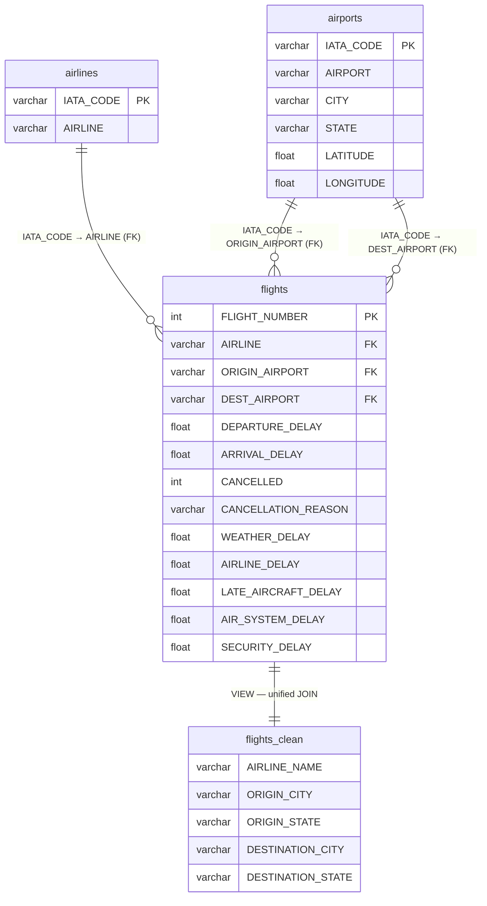

# ✈️ U.S. Airline Performance & Delay Analysis (2015)

*Analyzing 5.8 million flight records across 14 U.S. carriers — from raw CSV to business intelligence using structured SQL.*

[)](https://pritwrk.github.io/airline-sql-analysis/)
[](https://github.com/pritwrk/airline-sql-analysis)

---

## 📖 Project Overview

> **Goal:** Perform a full end-to-end SQL analysis on U.S. domestic airline performance data — covering database setup, data cleaning, and KPI generation — to identify delay patterns, cancellation trends, and carrier benchmarks.

This project works with a real-world dataset of **5,819,079 flights** from 2015, spanning 14 airlines and 322 airports across the United States. The analysis is structured in three phases:

- 🗄️ **Phase 1** — Database design, table creation, and data import
- 🧹 **Phase 2** — Data cleaning, NULL handling, and analytical view creation
- 📊 **Phase 3** — KPI queries covering performance benchmarking, delay analysis, and monthly trends

---

## 🗄️ Database Schema



---

## 📊 SQL Analysis — Phase Breakdown

### Phase 1: Database Setup & Table Creation

| Step | Operation | SQL Technique |
|------|-----------|---------------|
| 1 | Create database & tables | `CREATE DATABASE`, `CREATE TABLE` |
| 2 | Create flights table (31 columns) | `FLOAT`, `VARCHAR`, `INT` types |
| 3 | Import 3 CSVs via LOAD DATA | `LOAD DATA LOCAL INFILE` |
| 4 | Verify row counts post-import | `SELECT COUNT(*)` |

### Phase 2: Data Cleaning & Preparation

| Fix | Business Problem | SQL Technique |
|-----|-----------------|---------------|
| Fix 1 | Cancelled flights showing meaningless delay values | `UPDATE ... SET NULL WHERE CANCELLED = 1` |
| Fix 2 | Zero-delay columns misrepresenting absence of delay | `NULLIF(column, 0)` |
| Fix 3 | Raw cancellation codes (A/B/C/D) unreadable | `ALTER TABLE` + `CASE WHEN` mapping |
| Fix 4 | No date column for temporal analysis | `STR_TO_DATE()` batch update by month |
| Indexes | Slow queries on large table | `CREATE INDEX` on AIRLINE, CANCELLED, MONTH |
| View | Repetitive JOINs across all KPI queries | `CREATE VIEW flights_clean` |

### Phase 3: EDA & KPI Queries

| # | Business Question | SQL Technique |
|---|------------------|---------------|
| KPI 1 | Overall flight performance summary | `COUNT`, `SUM`, `AVG`, `ROUND` |
| KPI 2 | Airline-wise benchmarking (on-time rate, cancel rate) | `GROUP BY`, `CASE WHEN`, `ORDER BY` |
| KPI 3 | Month-wise trend analysis | `GROUP BY MONTH`, on-time % calculation |
| KPI 4 | Delay type breakdown (5 delay categories) | `AVG` per delay column, `WHERE CANCELLED=0` |
| KPI 5 | Delay types in row format for Power BI charts | `UNION ALL` |
| KPI 6 | Month-wise with readable month names | `CASE WHEN` month mapping |

---

## 🔑 Key Findings

| Metric | Value | Insight |
|--------|-------|---------|
| Best On-Time Airline | **Alaska Airlines** | 83.1% on-time rate |
| Worst Month | **February** | 3.59% cancellation rate, 15.41 min avg delay |
| Best Month | **September** | 0.54% cancellation rate, 82.3% on-time |
| Biggest Delay Type | **Late Aircraft** | Avg 22.3 min — cascading effect from prior flights |
| Overall Cancel Rate | **1.54%** | ~89,884 flights cancelled across 2015 |

---

## 📂 Repository Structure

```
airline-sql-analysis/
│
├── 📄 SQL queries.sql          ← Full SQL script (Phase 1 → 2 → 3)
├── 📊 AIRLINE dashboard.pbix   ← Power BI dashboard file
├── 📄 README.md                ← Project documentation
└── 🌐 index.html               ← Live dashboard (GitHub Pages)
```

---

## 🌐 Live Dashboard

> 🔗 **[View Interactive SQL Dashboard →](https://pritwrk.github.io/airline-sql-analysis/)**

The live dashboard is built in pure HTML/CSS/JS and hosted on GitHub Pages. It includes:

- All SQL queries with syntax-highlighted code blocks
- Hardcoded result tables for each query
- Top-down schema flowchart diagram
- Phase-wise structure (Setup → Cleaning → KPIs)
- Key insights summary

---

## 🚀 How to Run Locally

```bash
# Step 1 — Clone the repository
git clone https://github.com/pritwrk/airline-sql-analysis.git
cd airline-sql-analysis

# Step 2 — Open MySQL Workbench and connect to your local server

# Step 3 — Download the dataset
# Kaggle: US Airline Flight Routes and Performance 2015
# https://www.kaggle.com/datasets/usdot/flight-delays

# Step 4 — Update file paths in SQL queries.sql
# Find: LOAD DATA LOCAL INFILE 'C:/path/to/...'
# Replace with your actual CSV file paths

# Step 5 — Run the full script
# Open SQL queries.sql in MySQL Workbench
# Execute Phase 1 → Phase 2 → Phase 3 in order
```

> **Note:** The flights.csv import contains 5.8M rows and takes approximately 10–15 minutes.

---

## 🛠️ Tools Used

- **MySQL Workbench 8.0** — Query execution and database management
- **Power BI Desktop** — Dashboard creation and visualization
- **GitHub Pages** — Live HTML dashboard hosting

---

[](https://github.com/pritwrk)
[](https://linkedin.com/in/pritam-verma-02721531a)

Built by **Pritam Verma** · U.S. Airline Performance SQL Analysis
